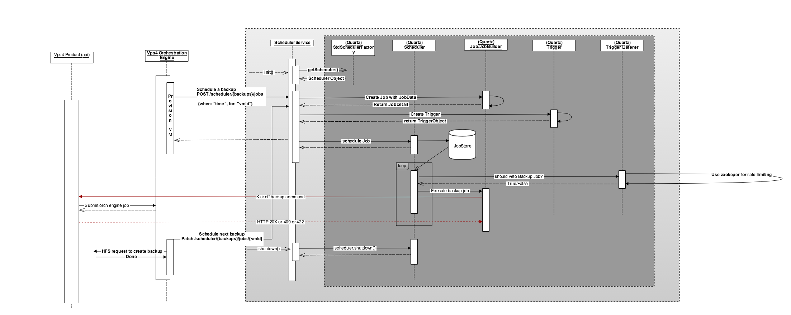

Scheduler
=========

The Scheduler is a general purpose service that allows Vps4 (or any product) to schedule jobs that need to be run asynchronously at a later point in time.

The scheduler has three pieces/components, a core component that implements the job scheduler,
a web component that exposes a RESTful CRUD interface for managing jobs and lastly a plugin(s)
component that defines the actual job that needs to be done. 
The job scheduler (in the core component) uses [Quartz](http://www.quartz-scheduler.org/) to
implement the job scheduler. The plugin component describes one or more **Jobs** that need to
be done by overriding the 'execute' method provided by JobScheduler class (Java class).
       
  
Job
===

The Job (which represents the work to be done) is just a class that extends the SchedulerJob class and overrides the 'execute' method.
The scheduler will call the 'execute' method of the Job class when it is time to run the job.
Inside the 'execute' method the Job can call/execute any code including api's exposed by other
micro-services.
A Job should be annotated with two annotations,
1. @Product: represents the product that this job is associated with
2. @JobGroup: represents the job group that this job is associated with

> An example Job might look something like:

    @Product("vps4")
    @JobGroup("backups")
    public class Vps4BackupJob extends SchedulerJob {
        private static final Logger logger = LoggerFactory.getLogger(Vps4BackupJob.class);

        Request request;

        @Override
        public void execute(JobExecutionContext context) throws JobExecutionException {
            JobKey key = context.getJobDetail().getKey();

            try {
                logger.info("*********** doing work ***********");
            }
            catch (Exception e) {
                logger.error("Error while processing backup job ({}) for request: {}", key, request);
            }
        }

        public void setRequest(Request request) {
            this.request = request;
        }

        public static class Request extends JobRequest {
            public UUID vmId;
        }
    }

> In the above example, the job has a field called 'request' that represents (and maps to) the data that was submitted as
part of the job creation (via the REST api) payload. The scheduler injects this (the payload) after instantiating but before
executing a job.

JobRequest
==========
JobRequest represents the data that's submitted as part of the job creation and is passed on to the the job when it is 
executed (refer to the previous section for details about this).
When a plugin defines a Job, it can define the job request call that the Job expects by embedding it as an inner class of
the Job class. The request class should inherit from the JobRequest class (see previous section for an example).

The JobRequest class supports validation during job creation time i.e. when a POST request is submitted to the job creation
endpoint. The JobRequest class supports 3 types of validation.
1. Mandatory/Required field validation: A job request class can use the annotation @_Required_ to identify fields that are 
   required and that should be provided when a job is being created (via the POST). A job request can also mark a field as 
   @_Optional_ but this is not compulsory. i.e. any field not annotated as @_Required_ is assumed to be @Optional.
2. Field level validation: A job request class can define a method with the following signature
   _**private void validateFieldNameOne() throws Vps4JobRequestValidationException {}_** to run validation checks for a field
   called 'fieldNameOne' on the request class.
3. Object level validation: A job request class can override the method called _**validate**_ to run object level checks.
   NOTE: This method should first delegate to the base validate method before run its own checks.

> An example JobRequest might look something like:

    public class JobRequestOne extends JobRequest {
        private static final Logger logger = LoggerFactory.getLogger(JobRequestOne.class);

        @Required public Integer jobParamOne;
        @Optional public UUID jobParamTwo;
        @Optional public String jobParamThree;

        private void validateJobParamOne() throws Vps4JobRequestValidationException {
            if (jobParamOne == 2) {
                throw new Vps4JobRequestValidationException("INVALID_PARAM_ONE", "Invalid value");
            }
        }

        private void validateJobParamThree() throws Vps4JobRequestValidationException {
            if (jobParamThree.equals("hello")) {
                throw new Vps4JobRequestValidationException("INVALID_PARAM_THREE", "Invalid value");
            }
        }

        @Override
        protected void validate() throws Exception {
            super.validate();
            if(jobParamOne == 3 && jobParamThree.equals("fail")) {
                throw new Vps4JobRequestValidationException(
                        "OBJ_LVL_FAIL",
                        "Object level validation failed");
            }
        }
    }

In the example above, jobParamOne is defined as a required field. If this field is not provided during job creation then
the job creation (POST request) will fail.
The request class defines two field level validations for fields 'jobParamOne' and 'jobParamThree'. No field level
validation is run for the field 'jobParamTwo'.
Finally, the request class also defines object level validation by overriding the method 'validate'.

TriggerListener
===============
The TriggerListener (which represents the a JIT check to see "if a job ready to be run should actually be run") provides 
is just a class that extends the SchedulerTriggerListener and overrides the 'vetoJobExecution' method. The scheduler will
call the vetoJobExecution method just before a job can be executed.

A TriggerListener should be annotated with two annotations,
1. @Product: represents the product that this TriggerListener is associated with
2. @JobGroup: represents the job group that this TriggerListener is associated with

> An example TriggerListener might look something like:

    @Product("vps4")
    @JobGroup("backups")
    public class Vps4BackupTriggerListener extends SchedulerTriggerListener {
        private static final Logger logger = LoggerFactory.getLogger(Vps4BackupTriggerListener.class);

        @Override
        public boolean vetoJobExecution(Trigger trigger, JobExecutionContext context) {
            logger.info("******** In vetoJobExecution *********");
            return false; // allow every job execution for now
        }
    }
    

Job Store
=========
The scheduler keeps its job and scheduling information in a job store. The job store supports two modes of job store
1. **Memory**: In this mode the scheduler keeps all of its job and scheduling data in RAM. Its fast and simple but the 
   drawback is that the data stored is ephemeral. Any time the scheduler is restarted all scheduling information is lost.
   Due to this, this mode is suited for local development where quick feedback and iteration is required.
   To run the scheduler in memory mode, add -Dscheduler.jobstore.mode=memory to thee VM arguments in scheduler run configurations.
   
2. **Database/JDBC**: In this mode the scheduler keeps all of its job and scheduling data in a database (PostgreSQL by default). 
   The data stored here persists across restarts.
   To build a database to setup the jobs for automated / on-demand backup, patching or for support user related things, run the following command on your localhost from the core project module.

       mvn initialize -Prebuild-scheduler-db
       
   To run the scheduler in jdbc mode, add -Dscheduler.jobstore.mode=jdbc to the VM arguments in scheduler run configurations.

REST interface
==============
The web module/component front the scheduler with a REST api exposing CRUD functionality to operate on jobs.
The scheduler organizes jobs under a 'product job group'. For example, the product 'vps4' may
create job(s) related to 'automatic backup creation' under the job group 'backups'.

The REST api provides the following CRUD functionality:

1. **GET**  /api/schedulers/{product}/{jobGroup}/jobs
   > The jobs (that haven't as yet been run) under a product job group can be listed by submitting
   a _GET_ request to /api/schedulers/{product}/{jobGroup}/jobs endpoint.
   
   > For example, the request below will get the list of jobs under the Vps4 backups group.
   
       curl -X GET --header "Accept: application/json" "http://localhost:8089/api/scheduler/vps4/backups/jobs"
    
2. **POST** /api/schedulers/{_product_}/{_jobGroup_}/jobs

   > A new job can be scheduled to run at a particular time by submitting a _POST_ request to
   /api/schedulers/{_product_}/{_jobGroup_}/jobs endpoint. The endpoint takes a JSON encoded
   payload as part of the request body. The only required key that needs to be included as part
   of the JSON encoded payload is 'when', which takes a ISO 8601 formatted string, that represents
   the time for when the newly created job should be scheduled to run.
   
   **NOTE**: _When the scheduler receives a request to schedule/create a new job under a job group, 
   it checks to see if a Job that matches the job group has already been registered by a plugin._
   
   > For example, the request below will submit a new backup job to be scheduled at "2017-09-21T23:58:16.797Z".
   It also pass an extra parameter 'vmId', that will be passed to the job when it finally executes.
   
       curl -X POST --header "Content-Type: application/json" --header "Accept: application/json" -d "{
         \"vmId\": \"79bfd10c-1529-42de-bd68-1a6e084ee13d\",
         \"when\": \"2017-09-21T23:58:16.797Z\",
         \"jobType\": \ONE_TIME\"
       }" "http://localhost:8089/api/scheduler/vps4/backups/jobs"
       
   **NOTE**: For recurring jobs pass jobType as 'RECURRING'. Also, field 'repeatIntervalInDays is required. Field 'repeatCount'
   is optional.
   
   
3. **GET** /api/schedulers/{product}/{jobGroup}/jobs/{jobId}

   > The details of a particular job can be obtained by submitting a _GET_ request to
   the /api/schedulers/{product}/{jobGroup}/jobs/{jobId} endpoint.
   
   > For example, the request below would fetch details about a job with jobId "5348dfe6-c87d-4f86-8b61-1d22f47c607e".
   
       curl -X GET --header "Accept: application/json"
       "http://localhost:8089/api/scheduler/vps4/backups/jobs/5348dfe6-c87d-4f86-8b61-1d22f47c607e"

   
4. **PATCH** /api/schedulers/{product}/{jobGroup}/jobs/{jobId}

   > An existing job can be rescheduled by submitting a _PATCH_ request to the /api/schedulers/{product}/{jobGroup}/jobs/{jobId}
   endpoint. The endpoint takes a JSON encoded payload as part of the request body. The only required key that needs to be included
   as part of the JSON encoded payload is 'when', which takes a ISO 8601 formatted string, that represents
   the new time to when the existing job should be re-scheduled to run.
    
   > For example, the request below will reschedule a job with jobId "5f60a394-190c-41bc-8f75-89627c03943a" to run at "2017-09-21T22:16:36.797Z".
   
       curl -X PATCH --header "Content-Type: application/json" --header "Accept: application/json" -d "{
         \"when\": \"2017-09-21T22:16:36.797Z\"
       }" "http://localhost:8089/api/scheduler/vps4/backups/jobs/5f60a394-190c-41bc-8f75-89627c03943a"
5. **DELETE** /api/schedulers/{product}/{jobGroup}/jobs/{jobId}
   > An existing job can be deleted by submitting a _DELETE_ request to the /api/schedulers/{product}/{jobGroup}/jobs/{jobId}
      endpoint.
      
   > For example, the request below will delete a job with jobId "5f60a394-190c-41bc-8f75-89627c03943a".
   
       curl -X DELETE --header "Accept: application/json" "http://localhost:8089/api/scheduler/vps4/backups/jobs/5348dfe6-c87d-4f86-8b61-1d22f47c607e"

Plugins
=======

Jobs (and TriggerListeners) of a product are packaged as plugins. The main requirement for a plugin is that it provide
an implementation of the SchedulerPluginModule. The implementation of the SchedulerPluginModule should provide
explicit bindings (guice) for Jobs and TriggerListeners that the plugin would like to register with the scheduler.

In the future a plugin can/will be packaged in a separate jar (separate from the scheduler).

As implemented right now, a plugin (or rather its implementation of the SchedulerPluginModule)
is statically added to the guice injector created by the scheduler service.
However, in the future plugins will be loaded by the scheduler service on startup via the JVM ServiceLoader mechanism
(the scheduler service will look for a META-INF/services/com.godaddy.vps4.scheduler.core.SchedulerPluginModule file packaged with a plugin jar)

How it works
============
As part of the SchedulerService startup the following happens to get everything wired up
1. As part of the guice injector creation (in Vps4SchedulerInjector), implementations of the Vps4SchedulerPluginModule 
are added to the the injector being created. NOTE: In the future this will be converted to a JVM ServiceLoader style registration mechanism.
2. A servlet context listener (SchedulerContextListener) is registered as part of the injector creation in Vps4SchedulerInjector.
3. Once the servlet container is ready, the SchedulerContextListener's 'contextInitialized' method is called by the servlet container.
   a. The SchedulerContextListener's 'contextInitialized' method then introspects the guice bindings registered looking for 
   plugin implementations of Job/TriggerListener and registers them with the scheduler service.
   b. It then starts the scheduler via a call to the schedulerService's startScheduler method.
4. The web module receives calls for job creation which in turn uses the Scheduler service's exposed methods to actually schedule jobs.
5. When it is time to actually run a job, the scheduler first confirms if a job should be run by calling the vetoJobExecution method of
   the registered trigger listener. If the job execution is not vetoed, the scheduler goes on to run the job by calling the Job classes 'execute' method.
   

Example flow (automatic backup creation)
======================================================

Interacting with the Vps4 api
=============================
The vps4 web module currently provides a client (for the Vm snapshot resource for the time being) with bindings for 
a Client cert based authentication and a SSO jwt based authentication. There is also support for injecting a Shopper id
into a 'X-Shopper-Id' header.
> An example of the usage is shown below

        String shopperId = "959998";
        UUID vmId = UUID.fromString("09022e35-6b2d-48c6-b293-d8cdb5207b19");
        UUID snapshotId = UUID.fromString("89111e35-6b2d-48c6-b293-d8cdb5207b19");

        Snapshot snapshot = withShopperId(shopperId, () -> {
            return vmSnapshotService.getSnapshot(vmId, snapshotId);
        }, Snapshot.class);
